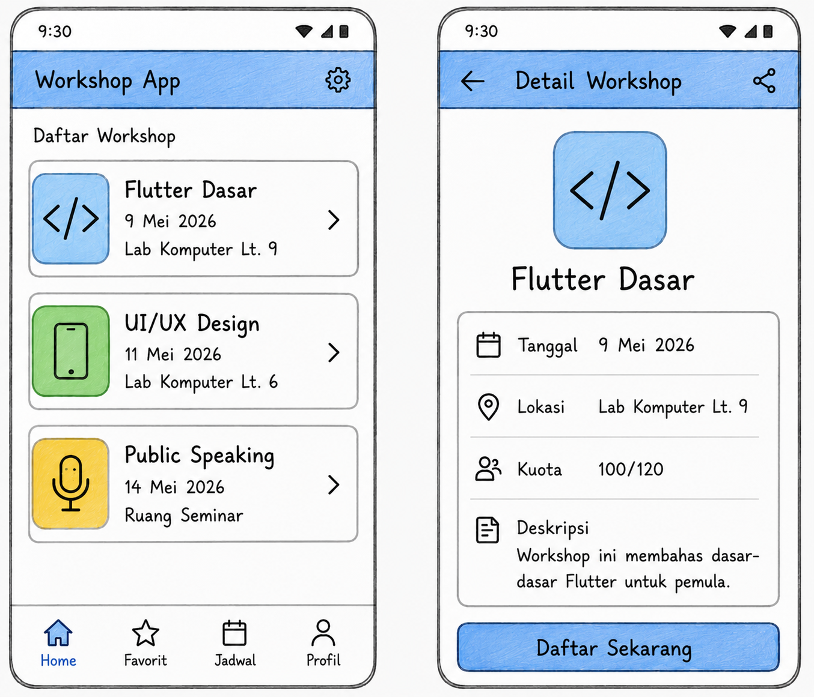

## 1. Sketsa Layout

## 2. Alasan Pemilihan Widget
- **Scaffold**  
    Memberikan struktur halaman (Material Design) seperti AppBar, body, dan bottom navigation.

- **AppBar**  
    Menampilkan judul aplikasi, tombol menu dan notifikasi agar pengguna tidak bingung berada di halaman berapa.

- **ListView**  
    Data workshop bisa bertambah banyak, sehingga perlu widget yang bisa discroll.

- **Card**  
    Membuat setiap workshop terlihat terpisah, rapi, dan fokus. Menambah kesan modern dengan elevation (efek bayangan).

- **Row**  
    Untuk menampilkan icon + teks secara horizontal (tanggal, lokasi, kuota).

- **ElevatedButton**  
    Tombol "Daftar Sekarang" dibuat menonjol dan mudah dikenali sebagai aksi utama.

- **BottomNavigationBar**  
    Membantu navigasi antar halaman utama (Beranda, Favorit, Saya, Profil).

---

## 3. Kesalahan UI yang Dihindari
1. **Terlalu Banyak Informasi Dalam Satu Layar**  
    Menampilkan terlalu banyak elemen tanpa hierarki yang jelas membuat pengguna bingung dan sulit fokus.

2. **Ukuran Teks Terlalu Kecil dan Warna Kurang Kontras**  
    Teks kecil dan warna yang mirip dengan background membuat informasi sulit dibaca, terutama di perangkat dengan layar kecil.

---

## 4. Kenyamanan Baca (UX)
1. **Hierarki Visual Jelas**
    Judul workshop lebih besar dan tebal, informasi lain lebih kecil agar mata mudah menangkap informasi utama

2. **Ruang (Spacing) yang Cukup**
    Setiap elemen diberi jarak (padding dan margin) sehingga tidak terasa padat dan mudah dibaca.

3. **Kontras Warna yang Baik**
    Teks gelap di atas latar terang dan tombol berwarna biru kontras agar mudah terlihat dan diakses.

4. **Penggunaan Card**
    Memisahkan setiap workshop dalam kartu, agar informasi tidak bercampur dan fokus pada satu item.

5. **Navigasi yang Mudah**
    Bottom Navigation membantu pengguna berpindah halaman tanpa kebingungan.    